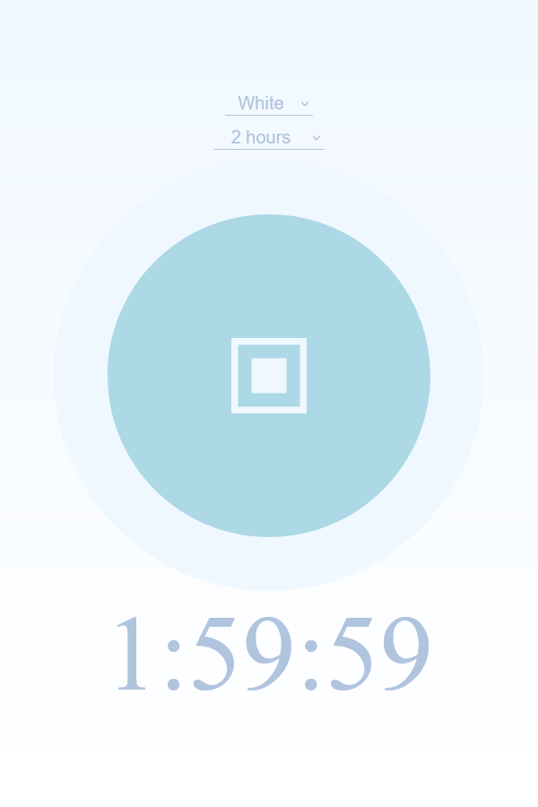

# Soothy
by ltGuillaume: [Codeberg](https://codeberg.org/ltGuillaume) | [GitHub](https://github.com/ltGuillaume) | [Buy me a beer](https://buymeacoff.ee/ltGuillaume) 🍺

A simple noise generator web app with timer and several types of noises. Can be used to focus or fall asleep more easily.

## How to use
- The web app is hosted at https://ltguillaume.codeberg.page/soothy
- To use it locally, or host it yourself:
  1. [Download](https://codeberg.org/ltguillaume/soothy/archive/main.zip) and extract the files somewhere, or clone [this repo](https://codeberg.org/ltguillaume/soothy.git).
  2. Locally, just run `index.html`. Otherwise, copy the contents of the repository onto your web server and navigate to the corresponding address.
- On a mobile browser, use `Add to Home screen` to get a shortcut on your Home screen.

## Credits
* [Moon icon](https://www.flaticon.com/free-icons/moon) created by [Cursor Creative](https://www.flaticon.com/authors/cursor-creative)
* Audio samples as collected by [@cliambrown](https://github.com/cliambrown) for the app [EasyNoise](https://github.com/cliambrown/EasyNoise/blob/master/app/src/main/res/raw/) ([GPLv3](https://www.gnu.org/licenses/gpl-3.0.html)):
	* Gray: [Gray noise](https://commons.wikimedia.org/w/index.php?title=File%3AGray_noise.ogg) by [Omegatron](https://commons.wikimedia.org/wiki/User:Omegatron); public domain.
	* Gray 2: [Inverse ITU-R 468 weighted "grey noise"](https://commons.wikimedia.org/w/index.php?title=File%3AInverse_ITU-R_468_weighted_%22grey_noise%22.ogg) by CapoeiraES;  [Creative Commons Attribution-Share Alike 4.0 International](https://creativecommons.org/licenses/by-sa/4.0/deed.en) license
	* White: [White-noise-sound-20sec-mono-44100Hz](https://commons.wikimedia.org/w/index.php?title=File%3AWhite-noise-sound-20sec-mono-44100Hz.ogg) by [Jorge Stolfi](https://commons.wikimedia.org/wiki/User:Jorge_Stolfi); [Creative Commons Attribution-Share Alike 3.0 Unported](https://creativecommons.org/licenses/by-sa/3.0/deed.en) license
	* Pink: [Pink noise](https://commons.wikimedia.org/w/index.php?title=File%3APink_noise.ogg) by [Omegatron](https://commons.wikimedia.org/wiki/User:Omegatron); Creative Commons Attribution-Share Alike [3.0 Unported](https://creativecommons.org/licenses/by-sa/3.0/deed.en), [2.5 Generic](https://creativecommons.org/licenses/by-sa/2.5/deed.en), [2.0 Generic](https://creativecommons.org/licenses/by-sa/2.0/deed.en) and [1.0 Generic](https://creativecommons.org/licenses/by-sa/1.0/deed.en) license
	* Brown: [Brown noise](https://en.wikipedia.org/wiki/File:Brownnoise.ogg) by Kieff; public domain
	* Purple: [Purple noise](https://commons.wikimedia.org/w/index.php?title=File%3APurple_noise.ogg) by [Omegatron](https://commons.wikimedia.org/wiki/User:Omegatron); Creative Commons Attribution-Share Alike [3.0 Unported](https://creativecommons.org/licenses/by-sa/3.0/deed.en), [2.5 Generic](https://creativecommons.org/licenses/by-sa/2.5/deed.en), [2.0 Generic](https://creativecommons.org/licenses/by-sa/2.0/deed.en) and [1.0 Generic](https://creativecommons.org/licenses/by-sa/1.0/deed.en) license